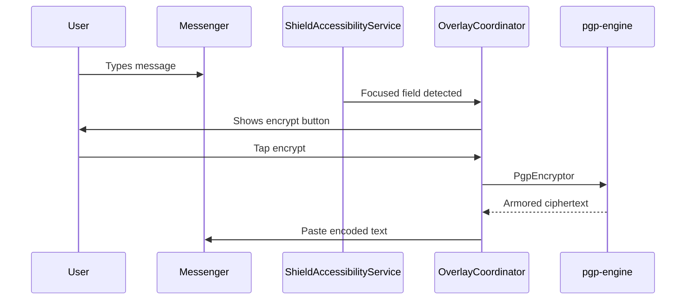

# PGP Shield

<p align="center">
  <strong>Modern Android OpenPGP key manager with accessibility overlay encryption.</strong>
</p>

<p align="center">
  <a href="LICENSE"></a>
  <a href="https://github.com/LTechnologies0/pgp-shield/actions/workflows/ci.yml"></a>
  <a href="https://github.com/LTechnologies0/pgp-shield/releases"></a>
  <a href="https://ltechnologies0.github.io/pgp-shield/"></a>
  
  
</p>

**PGP Shield** is an open-source Android app for managing OpenPGP keys and performing encryption in any messenger — inspired by [OpenKeychain](https://www.openkeychain.org/) and [Oversec](https://oversec.io/). Part of the [OnionPhone](https://onionphone.org) app family.

> Private keys never leave your device. Secret key material is stored in AES-GCM encrypted blobs.

---

## Table of contents

- [Features](#features)
- [Architecture](#architecture)
- [Install from GitHub Releases](#install-from-github-releases)
- [Build it yourself](#build-it-yourself)
- [API documentation (KDoc)](#api-documentation-kdoc)
- [Third-party integration](#third-party-integration)
- [Security](#security)
- [Contributing](#contributing)
- [License](#license)

---

## Features

| Feature | Description |
|---------|-------------|
| **Key management** | Create RSA-3072 keys, import/export armored rings, QR codes, subkeys, revocation certs |
| **Crypto workspace** | Encrypt/decrypt/sign/verify text and files; folder archives via GpgTar |
| **Overlay encryption** | Accessibility-service floating buttons to encrypt/decrypt in messenger text fields |
| **Text encoders** | Zero-width steganography, padding templates, base64, symmetric overlay encoding |
| **Dual API** | Custom `PgpShieldClient` AIDL + OpenIntents OpenPGP compatibility layer |
| **Share intents** | Encrypt/decrypt from any app via Android share sheet |
| **Keyserver lookup** | HKP search and key refresh |
| **Autocrypt** | Parse Autocrypt headers from incoming mail |
| **Security hardening** | Encrypted blob storage, FLAG_SECURE, sensitive clipboard wipe, log redaction |
| **i18n** | English, Spanish, French UI strings |
| **Material 3 UI** | Jetpack Compose with adaptive navigation |

### Overlay encryption flow



---

## Architecture

6-module Gradle project — see [docs/ARCHITECTURE.md](docs/ARCHITECTURE.md) for the full module graph.

```
:app
 ├── :pgp-engine    (Bouncy Castle OpenPGP)
 ├── :data          (Room + EncryptedFile vault)
 ├── :encoding      (overlay text transforms)
 └── :api-client    (AIDL integrator SDK)
```

| Layer | Technologies |
|-------|-------------|
| UI | Jetpack Compose, Material 3, Navigation Compose |
| DI | Dagger Hilt |
| Async | Kotlin Coroutines + Flow |
| Database | Room 2.7 + KSP |
| Crypto | Bouncy Castle bcprov + bcpg 1.79 |
| Storage security | AndroidX Security Crypto (EncryptedFile) |

---

## Install from GitHub Releases

1. Open **[Releases](https://github.com/LTechnologies0/pgp-shield/releases)**.
2. Download the APK matching your device CPU:

   | APK suffix | Devices |
   |------------|---------|
   | `arm64-v8a` | Most modern phones (2017+) |
   | `armeabi-v7a` | Older 32-bit ARM phones |
   | `x86_64` | Emulators, some tablets |
   | `x86` | Older emulators |

3. Enable **Install unknown apps** for your browser/files app.
4. Install the APK.

> Release APKs are signed with the project release key when CI secrets are configured. Verify the signature with `apksigner verify`.

---

## Build it yourself

### Prerequisites

| Tool | Version |
|------|---------|
| JDK | **21** (Temurin recommended) |
| Android SDK | API **37**, Build-Tools **36+** |
| Gradle | **9.3** (wrapper included) |

Set `ANDROID_HOME` / `ANDROID_SDK_ROOT` and create `local.properties`:

```properties
sdk.dir=/path/to/Android/Sdk
```

### One-shot commands by OS

<details>
<summary><strong>Linux / macOS</strong></summary>

```bash
# Clone
git clone https://github.com/LTechnologies0/pgp-shield.git && cd pgp-shield

# Debug APK (arm64-v8a, fastest)
./gradlew :app:assembleDebug

# All unit tests
./gradlew test

# Release APKs — all 4 ABIs (unsigned without keystore)
./gradlew :app:assembleRelease

# Release APKs — signed locally
cp keystore.properties.example keystore.properties
# Edit keystore.properties, then:
./gradlew :app:assembleRelease

# Install debug on connected device
./gradlew :app:installDebug

# API documentation
./gradlew dokkaGenerate
# → build/dokka/html/index.html
```

</details>

<details>
<summary><strong>Windows (PowerShell)</strong></summary>

```powershell
git clone https://github.com/LTechnologies0/pgp-shield.git; cd pgp-shield

# Debug APK
.\gradlew.bat :app:assembleDebug

# Tests
.\gradlew.bat test

# Release (all ABIs)
.\gradlew.bat :app:assembleRelease

# Install debug
.\gradlew.bat :app:installDebug

# Docs
.\gradlew.bat dokkaGenerate
```

</details>

### Output paths

| Task | Output |
|------|--------|
| `assembleDebug` | `app/build/outputs/apk/debug/app-<abi>-debug.apk` |
| `assembleRelease` | `app/build/outputs/apk/release/app-<abi>-release.apk` |
| `dokkaGenerate` | `build/dokka/html/index.html` |
| `test` | `**/build/reports/tests/` |

### Local release signing

```bash
bash scripts/generate-release-keystore.sh
cp keystore.properties.example keystore.properties
# Edit paths/passwords — never commit these files
./gradlew :app:assembleRelease
```

### Optional debug agent logging

Add to `local.properties` (gitignored) for local NDJSON debug ingest:

```properties
debugAgentEndpoint=http://127.0.0.1:7634/ingest/your-uuid
debugAgentSession=your-session-id
```

Requires `adb reverse tcp:7634 tcp:7634`. Empty by default — stripped entirely in release builds.

---

## API documentation (KDoc)

All public APIs are documented with **KDoc** in source. HTML reference is generated with **[Dokka](https://kotlinlang.org/docs/dokka-introduction.html)**:

```bash
./gradlew dokkaGenerate
# → build/dokka/html/index.html
```

**Live docs** (auto-deployed on push to `main`): [ltechnologies0.github.io/pgp-shield](https://ltechnologies0.github.io/pgp-shield/)

---

## Third-party integration

### PgpShieldClient (AIDL)

```kotlin
val client = PgpShieldClient.bind(context, "com.example.app")
val keys = client.listKeys()
val encrypted = client.encryptText(plaintext, recipientFingerprints)
```

Users must grant API access in PGP Shield settings. See KDoc on `PgpShieldService` and `GrantApiAccessActivity`.

### OpenIntents compatibility

Apps using `org.openintents.openpgp` intents can bind to `OpenPgpApiService` — same action constants as OpenKeychain.

---

## Security

- **No secrets in repo**: `keystore.properties`, `local.properties`, and keystores are gitignored.
- **Encrypted key storage**: armored secret keys in AES-256-GCM blobs.
- **API access control**: signature-verified callers + per-app key allowlists.
- **CI signing**: GitHub Actions secrets only — see [SECURITY.md](SECURITY.md).

| GitHub secret | Purpose |
|---------------|---------|
| `RELEASE_KEYSTORE_BASE64` | Base64-encoded keystore |
| `RELEASE_KEYSTORE_PASSWORD` | Keystore password |
| `RELEASE_KEY_ALIAS` | Key alias |
| `RELEASE_KEY_PASSWORD` | Key password |

Enable in repo settings: Dependabot alerts, secret scanning, push protection, CodeQL.

---

## Contributing

1. Fork and create a feature branch from `main`.
2. Run `./gradlew test :app:assembleDebug` before pushing.
3. Add KDoc for new public APIs.
4. Open a PR — CI runs tests, debug build, CodeQL, and dependency review.

See [CHANGELOG.md](CHANGELOG.md) for release history.

---

## License

**GPL-3.0-or-later** — see [LICENSE](LICENSE).

Bouncy Castle is licensed separately (MIT-style). AndroidX and Jetpack libraries under Apache 2.0.
