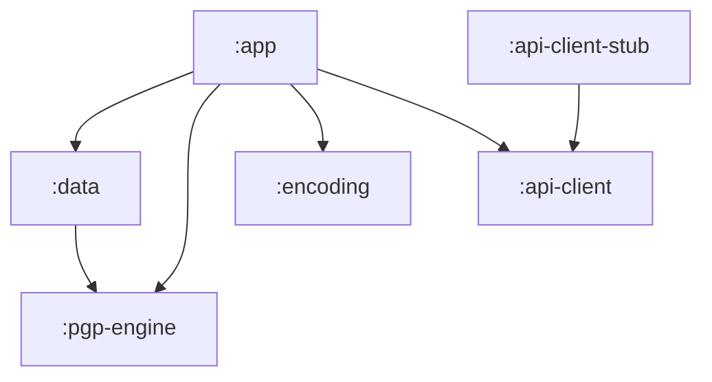

# PGP Shield — Architecture

PGP Shield is a **6-module** Gradle project in the OnionPhone app family. Dependencies flow **downward only** — the crypto engine has no Android UI dependencies.

## Module graph



## Module responsibilities

| Module | Package | Role |
|--------|---------|------|
| `:app` | `ltechnologies.onionphone.pgpshield` | Compose UI, intent activities, AIDL/OpenIntents services, accessibility overlay |
| `:pgp-engine` | `…engine` | Pure OpenPGP crypto (Bouncy Castle): encrypt, decrypt, sign, verify, key ops |
| `:data` | `…data` | Room metadata, encrypted blob vault, keyserver client, settings |
| `:encoding` | `…encoding` | Overlay text encoders (zero-width, padding, base64, symmetric) |
| `:api-client` | `…api` | `PgpShieldClient` + AIDL contract for third-party integrators |
| `:api-client-stub` | `…api` | In-memory stub for unit tests |

## Layered data flow

```
UI (Compose) / Intents / Overlay
        ↓
CryptoOperations (facade)
        ↓
KeyRepository + SettingsRepository
        ↓
pgp-engine (PgpEncryptor, PgpDecryptor, …)
        ↓
EncryptedBlobStore (AES-GCM armored key blobs)
```

## Key subsystems

### Key management

- **Room** stores key ring metadata (fingerprints, user IDs, trust, labels).
- **EncryptedBlobStore** holds armored secret/public key material in `EncryptedFile` (AES-256-GCM).
- **KeyserverClient** fetches keys via HKP over HTTPS.

### Crypto engine (`:pgp-engine`)

Stateless Kotlin objects wrapping Bouncy Castle:

- `KeyGenerator` / `KeyPairFactory` — RSA-3072 key creation
- `PgpEncryptor` / `PgpDecryptor` — message and file encryption
- `PgpSigner` / `PgpVerifier` — cleartext and detached signatures
- `SubkeyAdder` / `SubkeyRemover` — subkey lifecycle
- `GpgTar` — multi-file archive encrypt/decrypt
- `RevocationCertGenerator` / `RevocationCertApplier` — revocation handling

### Third-party integration

Two parallel APIs:

1. **`PgpShieldService`** — custom AIDL (`IPgpShieldService`), signature-protected permission `ltechnologies.onionphone.pgpshield.permission.API`
2. **`OpenPgpApiService`** — OpenIntents `IOpenPgpService2` compatibility for apps expecting OpenKeychain

Intent activities handle share/send flows (`EncryptTextActivity`, `DecryptFileActivity`, etc.).

### Accessibility overlay

Inspired by **Oversec**:

- `ShieldAccessibilityService` listens to focused text fields in configured messenger apps
- `OverlayCoordinator` shows floating encrypt/decrypt buttons
- `EncodingRegistry` applies zero-width or padding transforms before paste/send
- `OverlayPassphraseSession` caches passphrases in memory with TTL (cleared on screen-off)

### Security utilities (`:app` util)

| Component | Purpose |
|-----------|---------|
| `CallerVerifier` | Validates calling app signature for API access |
| `SensitiveClipboard` / `SensitiveWiper` | Auto-clear clipboard and char arrays |
| `LogRedactor` | Release Timber tree — redacts sensitive patterns |
| `SecureScreen` | `FLAG_SECURE` for screenshot blocking |
| `PrivacyLog` | Boolean privacy flags surviving ProGuard strip |

## Build configuration

| Setting | Value |
|---------|-------|
| minSdk | 26 |
| compileSdk / targetSdk | 37 |
| JVM | 21 |
| Release | R8 + resource shrink, per-ABI APK splits |

Shared Gradle scripts in `gradle/`:

- `release-signing.gradle` — local `keystore.properties` or CI `RELEASE_KEYSTORE_*` env
- `abi-release.gradle` — `armeabi-v7a`, `arm64-v8a`, `x86`, `x86_64`
- `privacy-logging.pro` — strips debug logging in release

## Testing

| Location | Coverage |
|----------|----------|
| `pgp-engine/src/test` | Crypto round-trips, malformed input, file crypto |
| `data/src/test` | Repository flows, keyserver mocking |
| `encoding/src/test` | Zero-width encoder |
| `app/src/test` | Intent I/O, log redactor, sensitive wiper |
| `app/src/androidTest` | Vault integration, keygen on device |

## Related projects

PGP Shield is a **peer app** in the OnionPhone suite (shared branding, signing patterns) — it is **not** part of [AndroWatch](https://github.com/LTechnologies0/AndroWatch).
